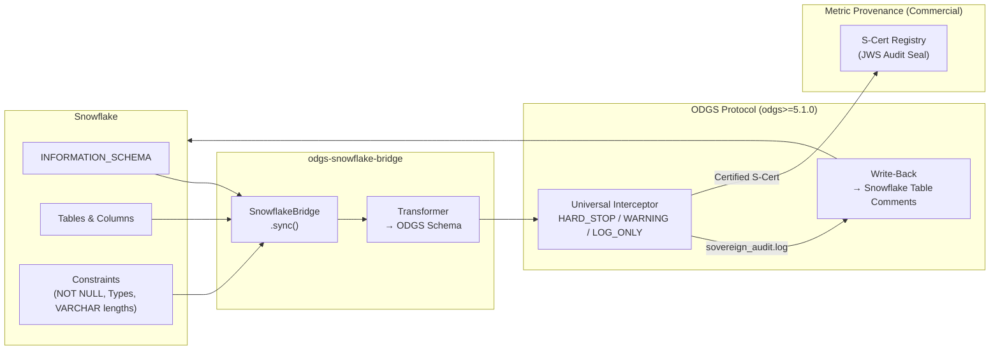

# ODGS Snowflake Bridge

[](https://opensource.org/licenses/Apache-2.0)
[](https://github.com/MetricProvenance/odgs-protocol)
[](https://pypi.org/project/odgs-snowflake-bridge/)
[](https://pypi.org/project/odgs-snowflake-bridge/)

**Transform your Snowflake Data Dictionary into active ODGS runtime enforcement schemas.**

> Snowflake stores your data. ODGS enforces the rules.

The ODGS Snowflake Bridge is an **institutional connector** that reads Snowflake `INFORMATION_SCHEMA` metadata and transforms table and column definitions into cryptographically addressable ODGS enforcement schemas. Column constraints, nullability rules, and type assertions become mechanically executable governance rules enforced at pipeline runtime — with full audit trail support via the ODGS S-Cert Registry.

Architecturally aligned with **CEN/CENELEC JTC 25** and **NEN 381 525** federated data sovereignty principles.

---

## Architecture



---

## Three Rule Types Generated

| Column Property | Rule Type | Example |
|---|---|---|
| `NOT NULL` constraint | `NOT_NULL` | `TXN_ID != None` |
| Data type | `TYPE_CHECK` | `type(AMOUNT) == 'numeric'` |
| `VARCHAR(N)` length | `MAX_LENGTH` | `len(CURRENCY) <= 3` |

Supports 35+ Snowflake data types including `VARIANT`, `OBJECT`, and `ARRAY` semi-structured types.

---

## Install

```bash
pip install odgs-snowflake-bridge
```

---

## Quick Start

### Python API

```python
from odgs_snowflake import SnowflakeBridge

bridge = SnowflakeBridge(
    account="xy12345.eu-west-1",
    user="odgs_service",
    password="...",
    organization="acme_corp",
)

# Sync all tables → ODGS metric definitions
bridge.sync(
    database="PRODUCTION",
    output_dir="./schemas/custom/",
    output_type="metrics",
)

# Sync column constraints → enforcement rules
bridge.sync(
    database="PRODUCTION",
    schema_filter="FINANCE",
    output_dir="./schemas/custom/",
    output_type="rules",
    severity="HARD_STOP",
)
```

### CLI

```bash
# Using environment variables
export SNOWFLAKE_ACCOUNT=xy12345.eu-west-1
export SNOWFLAKE_USER=odgs_service
export SNOWFLAKE_PASSWORD=...

odgs-snowflake sync \
    --org acme_corp \
    --database PRODUCTION \
    --schema FINANCE \
    --type rules \
    --severity HARD_STOP

# SSO / Browser authentication
odgs-snowflake sync \
    --account xy12345.eu-west-1 \
    --user user@company.com \
    --authenticator externalbrowser \
    --org acme_corp \
    --database PRODUCTION

# Push compliance results back to Snowflake table comments
odgs-snowflake write-back \
    --log-path ./sovereign_audit.log \
    --account xy12345.eu-west-1 \
    --user odgs_service \
    --password YOUR_PASSWORD
```

### Output Schema

```json
{
  "$schema": "https://metricprovenance.com/schemas/odgs/v5",
  "metadata": {
    "source": "snowflake",
    "organization": "acme_corp",
    "tables_processed": 8,
    "items_generated": 47
  },
  "items": [
    {
      "rule_urn": "urn:odgs:custom:acme_corp:rule:transactions_amount_not_null",
      "name": "TRANSACTIONS.AMOUNT NOT NULL",
      "severity": "HARD_STOP",
      "constraint_type": "NOT_NULL",
      "target_table": "PRODUCTION.FINANCE.TRANSACTIONS",
      "plain_english_description": "Transaction amount must be present in all financial records",
      "content_hash": "a1b2c3..."
    }
  ]
}
```

---

## Bi-Directional Write-Backs

The bridge supports **Bi-Directional Sync**: it parses your `sovereign_audit.log` offline and pushes compliance results back into Snowflake table comments using `ALTER TABLE ... SET COMMENT` — creating a seamless feedback loop for Data Stewards without compromising the air-gapped nature of the core ODGS protocol.

---

## Authentication

| Method | CLI Flags | Environment Variables |
|---|---|---|
| Password | `--user` + `--password` | `SNOWFLAKE_USER` + `SNOWFLAKE_PASSWORD` |
| SSO / Browser | `--authenticator externalbrowser` | — |
| Account | `--account` | `SNOWFLAKE_ACCOUNT` |

---

## Regulatory Alignment

This bridge is designed for organisations governed by:

| Regulation | Relevance |
|---|---|
| **DORA (Regulation EU 2022/2554)** | ICT operational resilience — data integrity and lineage traceability across Snowflake workloads |
| **EU AI Act (2024/1689) Articles 10 & 12** | Training data governance and audit trail for High-Risk AI Systems using Snowflake as a data source |
| **Basel Committee BCBS 239** | Risk data aggregation — accuracy and completeness of financial data stored in Snowflake |
| **GDPR Article 5(2)** | Accountability principle — demonstrable, auditable data governance |

> For cryptographic legal indemnity (Ed25519 JWS audit seals, certified Sovereign Packs for DORA/EU AI Act), see the **[Metric Provenance Enterprise Platform](https://platform.metricprovenance.com)**.

---

## Requirements

- Python ≥ 3.9
- `odgs` ≥ 5.1.0 (core protocol)
- `snowflake-connector-python` ≥ 3.0.0
- Snowflake account with `INFORMATION_SCHEMA` access

---

## Related

- [ODGS Protocol](https://github.com/MetricProvenance/odgs-protocol) — The core enforcement engine
- [ODGS FLINT Bridge](https://github.com/MetricProvenance/odgs-flint-bridge) — TNO FLINT legal ontology connector
- [ODGS Collibra Bridge](https://github.com/MetricProvenance/odgs-collibra-bridge) — Collibra integration
- [ODGS Databricks Bridge](https://github.com/MetricProvenance/odgs-databricks-bridge) — Unity Catalog integration

---

## License

Apache 2.0 — [Metric Provenance](https://metricprovenance.com) | The Hague, NL 🇳🇱
